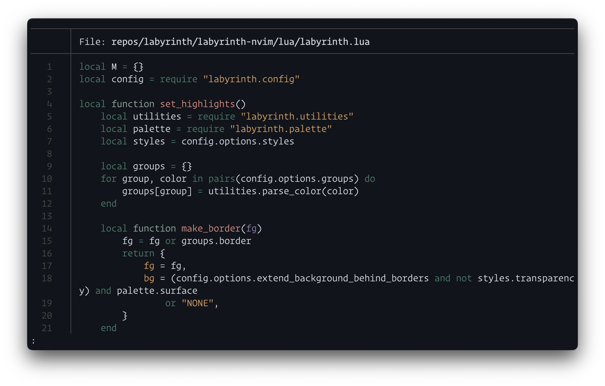
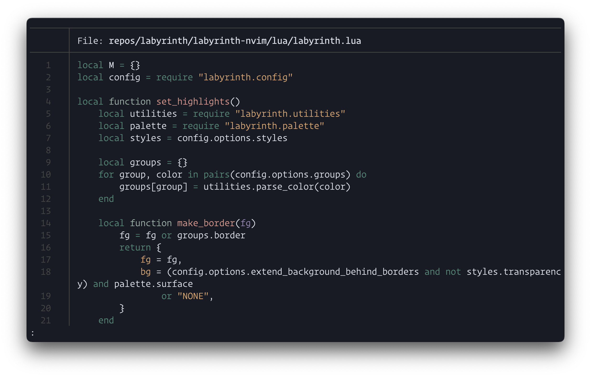
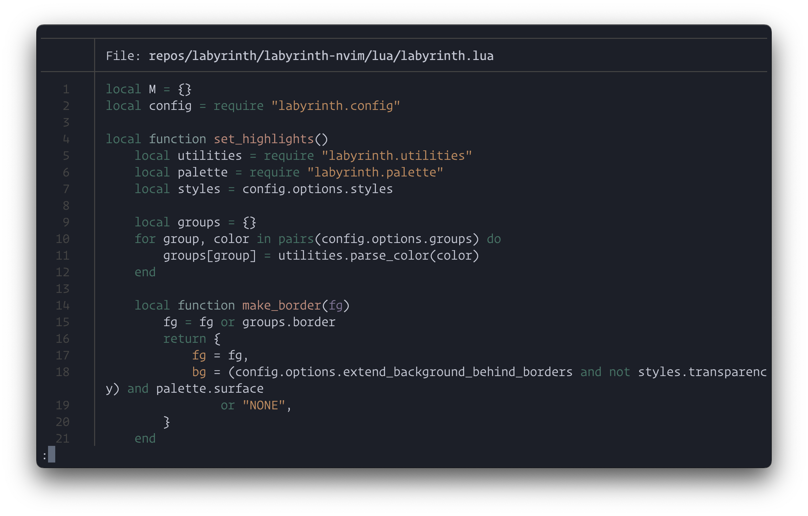
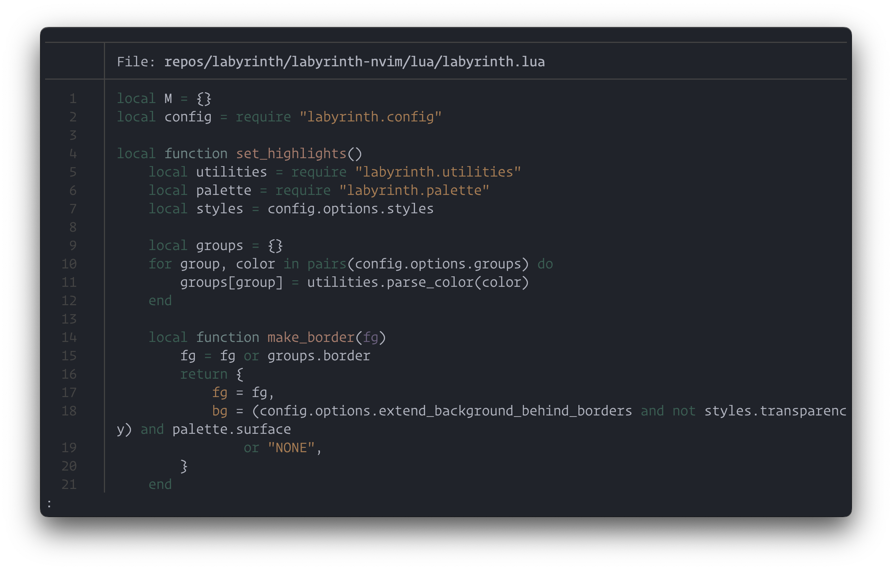

# 🌿 Labyrinth

Discover Labyrinth, a serene color scheme inspired by hidden pathways and mossy landscapes. Let its gentle tones guide your creativity with calm elegance.

Labyrinth provides four distinct variants with varying levels of contrast and color vibrancy to suit your preferences:

 - **Gloom**: The most contrasty variant, perfect for those who prefer sharp distinctions and vibrant colors.
 - **Dusk**: A balanced variant, offering a comfortable middle ground with moderate contrast and vibrancy.
 - **Shade**: A softer variant with reduced contrast, ideal for a more subdued and relaxed visual experience.
 - **Mist**: The least contrasty variant, featuring the most gentle and subtle tones for a calm and unobtrusive interface.

Whether you're coding, designing, or simply exploring new aesthetics, Labyrinth adapts to your needs with its harmonious palette.

## Usage

**Example:** [sharkdp/bat](https://github.com/sharkdp/bat)

1. Create a new `themes` directory in your _**bat**_ config directory, usually
   located at `~/.config/bat/themes`:

   ```sh
   mkdir -p "$(bat --config-dir)/themes"
   cd "$(bat --config-dir)/themes"
   ```

2. Copy one or more `rose-pine{-dawn,-moon}.tmTheme` to the new `themes`
   directory:

   ```sh
   curl --remote-name-all https://raw.githubusercontent.com/dgabka/labyrinth-tm-theme/main/dist/labyrinth{-gloom,-dusk,-shade,-mist}.tmTheme
   ```

3. Now, update the theme cache for _**bat**_ by running the following command:

   ```sh
   bat cache --build
   ```

4. Finally, add `export BAT_THEME="labyrinth-dusk"` into your shell configuration
   file, or, run the following command:

   ```sh
   echo '--theme="labyrinth-dusk"' >> "$(bat --config-file)"
   ```

   _Remember to change `dusk` to `gloom`, `shade` or `mist` if
   you prefer those variants._

## Gallery

**Labyrinth Gloom**



**Labyrinth Dusk**



**Labyrinth Shade**



**Labyrinth Mist**



### Credits

Thanks to the [Rosé Pine](https://github.com/rose-pine) creators!
A special thanks to [Rosé Pine for TextMate theme compatible apps](https://github.com/rose-pine/tm-theme) which this theme is based on.

